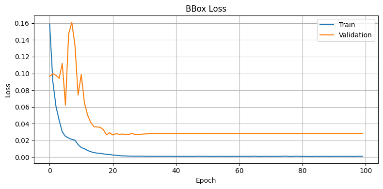
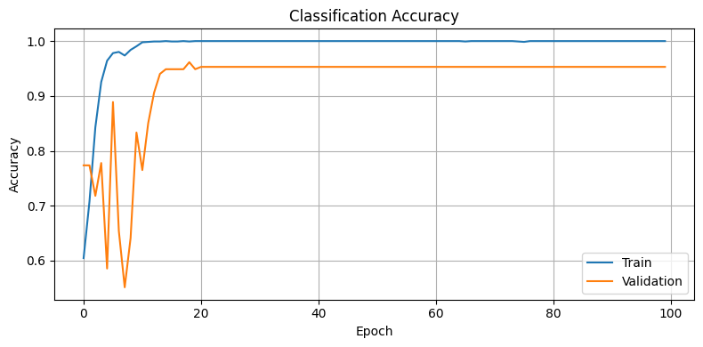
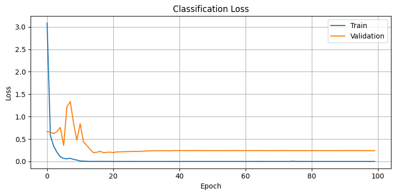
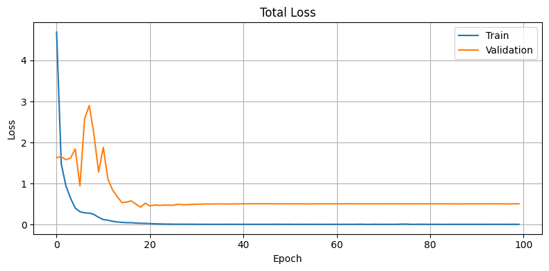
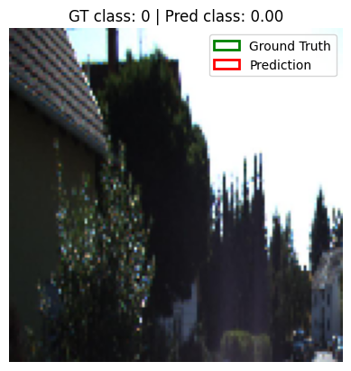
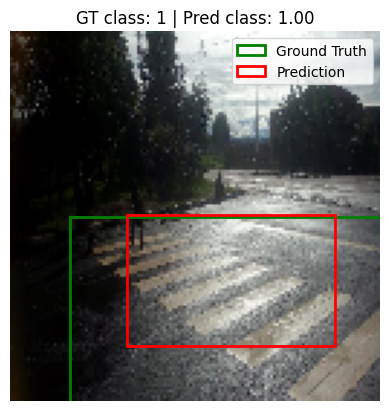
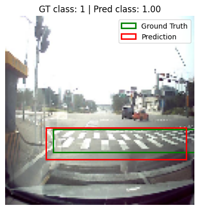
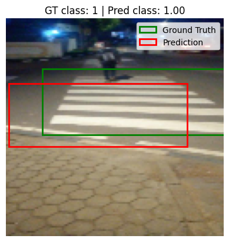

# ZebraCrossingDetection

A deep learning-based computer vision project to detect zebra crossings in images using a custom-trained object detection model. The model is trained using Resnet50 and fine-tuned on a curated dataset to enhance real-world performance in urban and smart city environments.

---

## 📂 Project Overview

This project aims to:
- Detect zebra crossings (vạch qua đường) in various lighting and traffic conditions.
- Support applications such as autonomous driving, smart traffic systems, and assistive navigation.
- Train and evaluate a Resnet50 model using a custom annotated dataset.

---

## 🧠 Model Information

- **Model Architecture**: Resnet50
- **Training Duration**: 100 epochs
- **IoU Threshold**: 0.5
- **Dataset Version**: `datav2`
- **Notebook**: [`Final_final_datav2_100epoch_0.5iou.ipynb`](./Final_final_datav2_100epoch_0.5iou.ipynb)

---


## 📁 Dataset
The dataset is a custom-labeled dataset of zebra crossings. It includes:

- Zebra Crossing in many diverse conditions (sunny, night, crowded, empty)

- Labeled in PASCAL VOC format


## 🗂️ Repository Structure

```bash
ZebraCrossingDetection/
├── dataset/                            # Training and validation datasets (not included)
├── Final_final_datav2_100epoch_0.5iou.ipynb  # Main training notebook
├── README.md                       # Project documentation
└── .gitignore                      # Git ignored files
```

## 📊 Evaluation Metrics
- IOU (Intersection over Union), Accuracy, Precision, Recall

- After train model in 100 epoch, we have some metric:
  - .png)
  - 
  - 
  - 
  - 

## 📸 Output
**We have classification output and IoU:**


## Demo with some images





## How to Run
1. Clone the repository
```bash
git clone https://github.com/yourusername/ZebraCrossingDetection.git
```

2. Install dependencies
Create a virtual environment (optional but recommended):

```bash
python -m venv venv
source venv/bin/activate  # On Windows: venv\Scripts\activate
```
3. Train or evaluate model
Open the Jupyter Notebook:

```bash
jupyter notebook Final_final_datav2_100epoch_0.5iou.ipynb
```

## 📌 Future Improvements
- Convert model to ONNX or TensorRT for real-time deployment

- Integrate into a mobile/web application

- Enhance dataset with more diverse scenarios

👨‍💻 Author
Le Quy Nhan – [NahwngLe](https://github.com/NahwngLe)

Feel free to open issues or pull requests for improvements or bugs.

📝 License
This project is licensed under the MIT License - see the LICENSE file for details.

---
